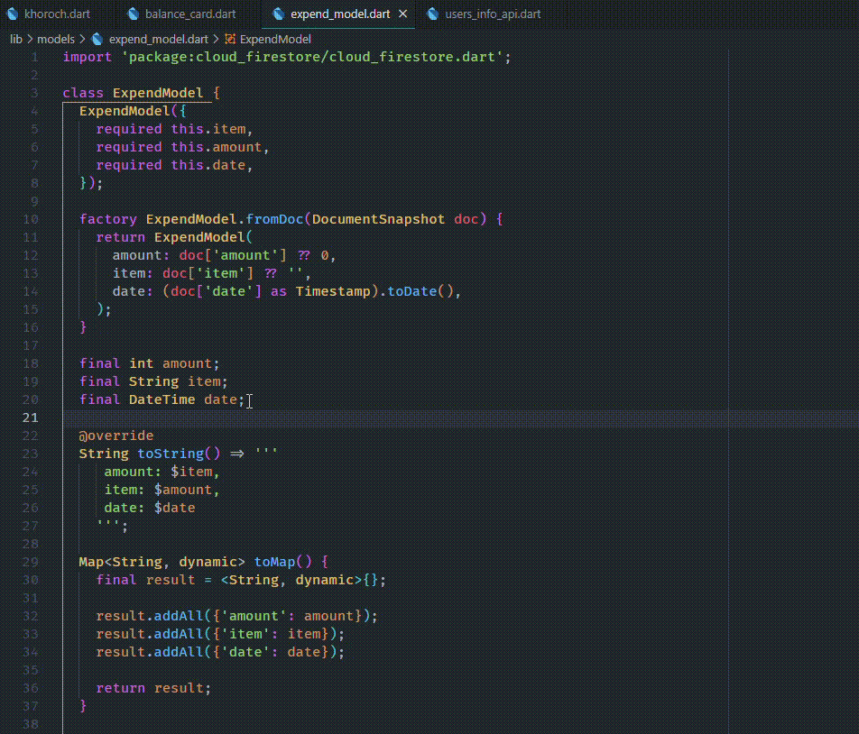

# fire-util-flutter (ALPHA)

This is a utility extension for firebase and flutter.

## Features

- [x] create static field from selected fields in a Data Class.
- [ ] Add Snippets
- [ ] and more

---

create static field from selected fields in a Data Class:

## Requirements

Nothing.

## Extension Settings

None.

## Known Issues

None.

## Release Notes

### 0.0.1

Alpha release.

---
